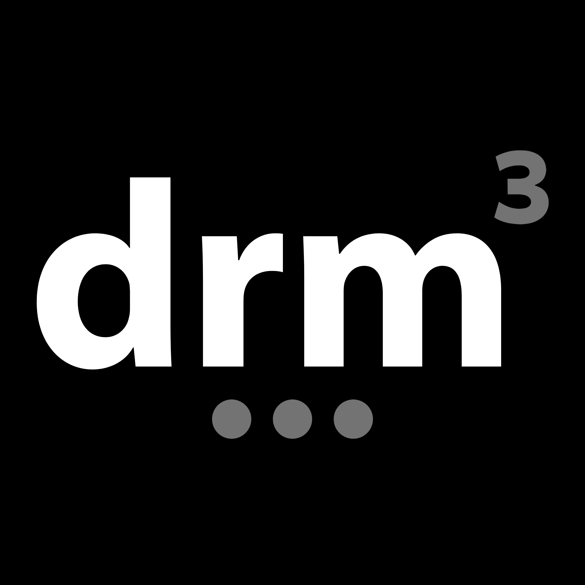
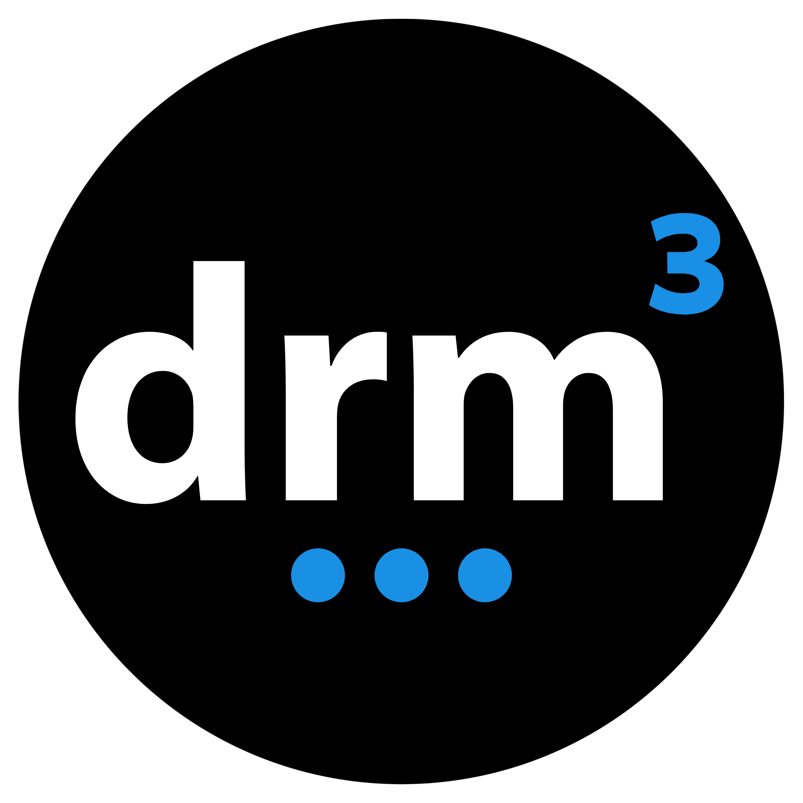
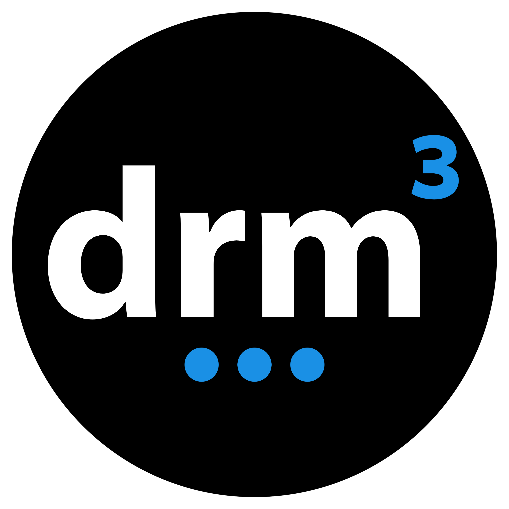
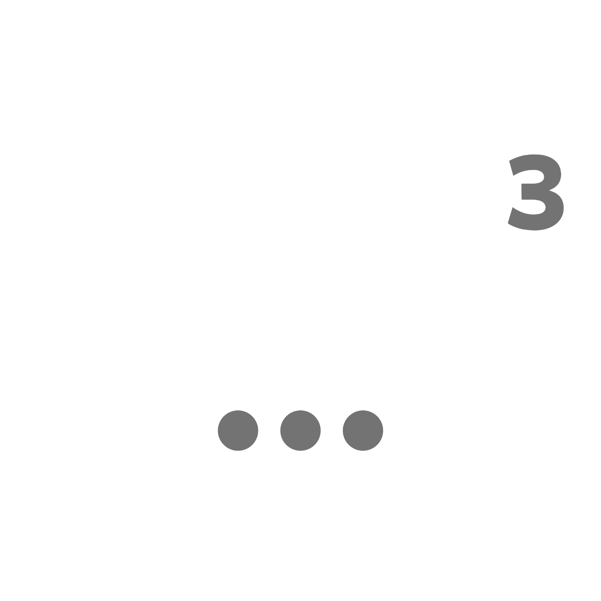

# DRM3 Brand Assets

## Favicons

## Logos

<a href="https://github.com/DRM3Labs/drm3labs-branding/blob/main/logos/0001.jpg">

</a>

<a href="https://github.com/DRM3Labs/drm3labs-branding/blob/main/logos/0002.jpg">

</a>

<a href="https://github.com/DRM3Labs/drm3labs-branding/blob/main/logos/0003.jpg">

</a>

<a href="https://github.com/DRM3Labs/drm3labs-branding/blob/main/logos/0003_transparent.png">

</a>

<a href="https://github.com/DRM3Labs/drm3labs-branding/blob/main/logos/0006_transparent.png">

</a>

## Fonts

* IBM Plex Sans Hebrew
* NOTO Sans

