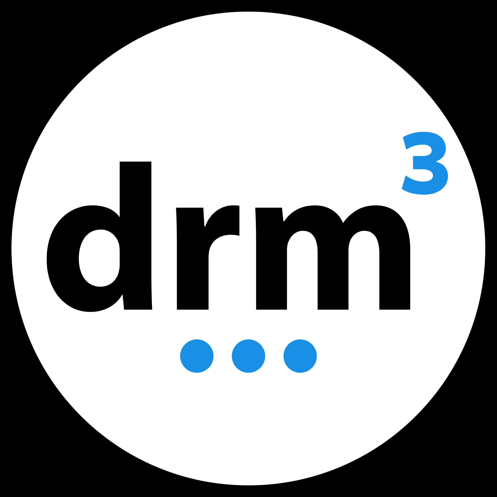
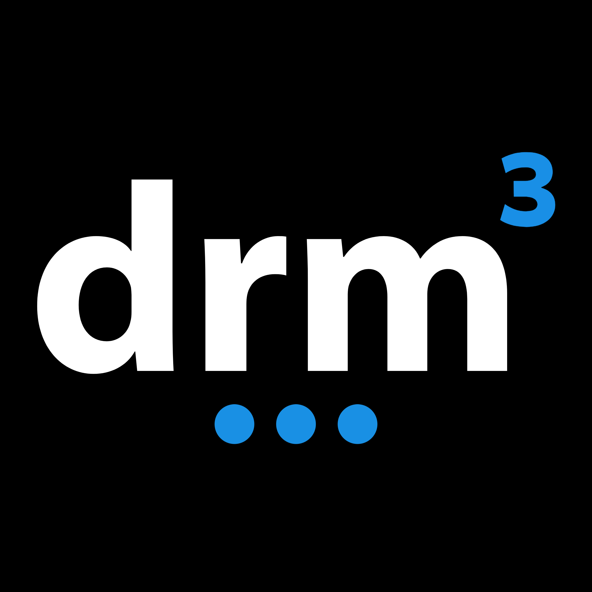

<!---WARNING:  This file is autogenerated by genreadme.md--->

# colors

  
#FDC003

  
#05A154

  
#2F9CFB

  
#FB3D8E

  
#D3D3D3

  
#FFFFFF

# favicon
## png

  
  
  
  

# linkedin
## png

  
  
  
  

# logos
## jpg

  
  
  
  
  
  
  
  
  
  
  
  
  
  
  

## png

  
  
  
  
  
  
  
  
  
  
  
  
  
  
  
  

# marketing
## jpg

  

## png

  
  
  
  

# network
## png

  
  
  

# nfts
## png

  
  
  
  

# pr
## png

  
  

# qr_code
## png

  

# sdk
## jpg

  

## png

  
  
  

# zoom
## jpg

  
  
  
  
  
  

