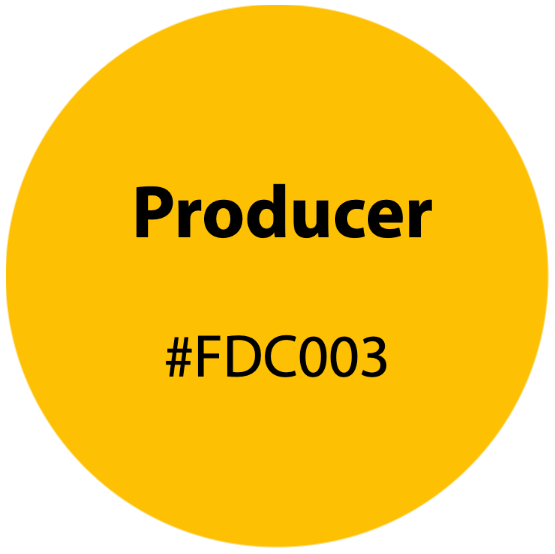

<!---WARNING:  This file is autogenerated by genreadme.md--->

<a href="./LICENSE.txt">&copy; Copyright 2023 drm3labs.io</a>

This file is auto-generated.

## colors
### png

  
  
  
  
  

## favicon
### png

  
  
  
  

## labs
### png

  
  
  

## logo-circle
### jpg

  
  

### png

  
  

## logos
### jpg

  
  
  
  
  
  
  
  

### png

  
  
  
  
  
  

## marketing
### jpg

  
  

### png

  
  
  
  
  
  

## nfts
### png

  
  
  
  

## pr
### png

  
  

## qr_code
### png

  

## sdk
### jpg

  

### png

  
  
  

## wordmark
### jpg

  
  
  
  

### png

  
  

